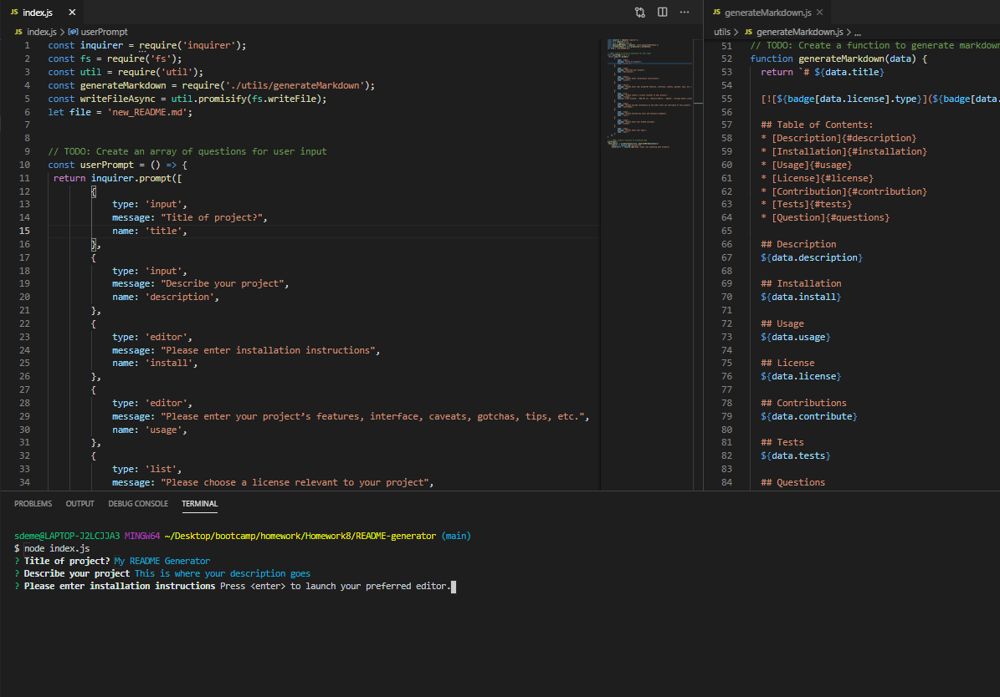

### README Generator

A README generator app that allows developers to quickly and easily create a README file by using a command-line application to generate one. This will allow the project creator to devote more time to working on the project.

## Table of contents

- [General info](#general-info)
- [User Story](#user-story)
- [Acceptance Criteria](#acceptance-criteria)
- [Screenshots](#sscreenshots)
- [Demo](#demo)
- [Technologies](#technologies)
- [Status](#status)

## General info.

This README generator is intialized when a user enters node index.js into the command line. THe user will then be propted to answer a series of questions regarding their application. Once all questions have been answered, the user's input will populate into the new_README.md file.

## User Story
```
AS A developer
I WANT a README generator
SO THAT I can quickly create a professional README for a new project
```

## Acceptance Criteria
```
GIVEN a command-line application that accepts user input
WHEN I am prompted for information about my application repository
THEN a high-quality, professional README.md is generated with the title of my project and sections entitled Description, Table of Contents, Installation, Usage, License, Contributing, Tests, and Questions
WHEN I enter my project title
THEN this is displayed as the title of the README
WHEN I enter a description, installation instructions, usage information, contribution guidelines, and test instructions
THEN this information is added to the sections of the README entitled Description, Installation, Usage, Contributing, and Tests
WHEN I choose a license for my application from a list of options
THEN a badge for that license is added near the top of the README and a notice is added to the section of the README entitled License that explains which license the application is covered under
WHEN I enter my GitHub username
THEN this is added to the section of the README entitled Questions, with a link to my GitHub profile
WHEN I enter my email address
THEN this is added to the section of the README entitled Questions, with instructions on how to reach me with additional questions
WHEN I click on the links in the Table of Contents
THEN I am taken to the corresponding section of the README
```

## Screenshots


## Technologies
* node.js
* Inquirer
* Javascript

## Status
Project is: _in progress_
Always looking to improve.

Link to repository: https://sdemercurio.github.io/README-generator/
Link to walkthrough video: https://youtu.be/D4PIeCDu7Sg

